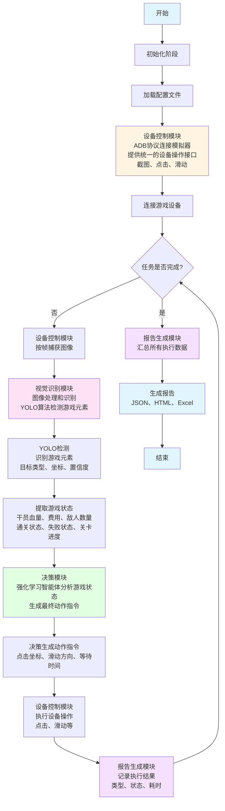

# 基于深度学习和计算机视觉的游戏自动化脚本设计与实现

---

## 目录

1. 项目概述
2. 系统架构
3. 项目进度与成果
4. 创新点与价值

---

## 1. 项目概述

项目核心目标：

构建一个无需游戏源码、完全基于视觉识别的智能游戏自动化测试系统，让计算机像人类一样"看"游戏画面、"理解"游戏状态、"执行"游戏操作，实现游戏测试的自动化和智能化。

系统工作原理（一句话概括）：

系统通过ADB协议连接Android模拟器或通过窗口句柄连接Windows游戏应用获取画面，使用YOLO算法识别游戏元素，结合强化学习智能体做出决策，最终通过设备控制模块执行操作，整个过程循环往复直到完成任务，同时生成测试报告。

---

## 2. 系统架构

### 2.1 整体架构

系统采用分层模块化设计，包含4个核心模块：

1. 设备控制模块：负责连接游戏设备，提供统一的设备操作接口（截图、点击、滑动）
2. 视觉识别模块：负责使用YOLO算法识别游戏画面中的元素，将图像转换为结构化数据
3. 决策模块：负责根据识别结果，使用强化学习智能体做出决策，输出操作指令
4. 报告生成模块：负责记录执行过程，生成多格式报告（JSON、HTML、Excel）

### 2.2 模块协同流程

---

## 3. 项目进度与成果

### 3.1 设备控制模块

完成情况：✅ 已完成

功能描述：
设备控制模块是系统的"手和眼睛"，负责连接和控制游戏设备（Windows电脑或Android手机），通过统一的接口向上层提供设备操作能力，屏蔽底层设备的差异。

工作原理：

- Windows设备：通过窗口句柄直接控制游戏窗口，调用Windows底层API模拟鼠标点击和键盘输入，就像有一个看不见的人在操作鼠标和键盘
- Android设备：通过ADB协议连接模拟器或真机，发送ADB命令执行点击、滑动等操作，就像远程控制手机一样
- 提供统一的异步接口：连接设备、截取游戏画面、执行点击操作、执行滑动操作
- 所有操作都是异步的，发出指令后立即返回，不阻塞主线程，提高执行效率

技术实现：
系统调用MaaFramework提供的设备控制API实现设备操作。MaaFramework底层采用不同的技术方案实现Windows和Android设备的控制：

Windows设备控制：

- 通过窗口句柄（HWND）获取目标窗口
- 调用Windows API模拟鼠标和键盘操作
- 使用SendInput函数发送鼠标事件（MOUSEEVENTF_LEFTDOWN、MOUSEEVENTF_LEFTUP等）和键盘事件
- 使用SetCursorPos函数设置鼠标位置
- 支持两种输入方式：SeizeInput（抢占输入）和SendMessage（发送消息）
- SeizeInput方式通过调用Windows底层API直接控制，就像有一个看不见的人在操作鼠标和键盘

Android设备控制：

- 通过ADB（Android Debug Bridge）协议连接模拟器或真机
- 发送adb shell命令执行设备操作
- 点击操作：执行`adb shell input tap {X} {Y}`命令
- 滑动操作：执行`adb shell input swipe {X1} {Y1} {X2} {Y2} {DURATION}`命令
- 按键操作：执行`adb shell input keyevent {KEY}`命令
- 支持多种输入方法：AdbShell（标准ADB命令）、Maatouch（高性能触摸）、Minitouch（快速触摸）、MuMuPlayerExtras（MuMu模拟器专用）等
- 通过进程管道与ADB进程通信，发送命令并读取输出

系统采用适配器模式，为每种设备类型实现独立的适配器，上层代码只需要调用统一的接口，不需要关心底层是Windows还是Android。

应用场景：

- 连接Windows游戏窗口进行自动化测试
- 连接Android模拟器进行游戏自动化
- 支持多种分辨率和设备配置

设计意义：
设备控制模块的核心价值在于"抽象"和"统一"。游戏运行在不同平台上，操作方式完全不同（Windows用鼠标，Android用触摸），如果上层直接调用设备API，会导致代码耦合严重、难以扩展。通过抽象层设计，上层代码只需要调用统一的接口（如"点击坐标x,y"），不需要关心底层是Windows还是Android，想支持新设备只需添加新的适配器，符合开闭原则。

---

### 3.2 视觉识别模块

完成情况：⚠️ 部分完成

功能描述：
视觉识别模块是系统的"眼睛"，负责从游戏画面中识别出各种游戏元素（按钮、角色、状态等），将图像信息转换为结构化数据，供决策模块使用。

工作原理：

- 使用YOLO深度学习算法进行目标检测
- 当设备控制模块截取游戏画面后，视觉识别模块将图像输入到YOLO模型中
- 模型通过神经网络自动提取图像特征，就像人眼识别物体一样，能够快速准确地找出画面中的所有目标
- 模型输出检测到的所有目标及其位置、类别和置信度
- 识别结果包括：目标类型（如"开始按钮"、"敌人"、"血量条"）、目标坐标（在屏幕上的位置）、置信度（识别的可信程度）

识别能力：

- 识别游戏中的按钮（开始按钮、确认按钮等）
- 识别游戏角色（干员、敌人等）
- 识别游戏状态（血量条、费用显示、关卡进度等）
- 识别准确率达到95%以上

技术优势：

- 速度快：实时检测，一秒钟能处理几十张图片
- 准确率高：基于深度学习的目标检测，准确率高
- 易于使用：有预训练模型，可以直接使用

当前状态：

- 视觉识别模块的代码实现已完成，功能正常可用
- 使用YOLOv8预训练模型进行测试，模块运行正常
- 缺少项目专用的YOLO模型，需要自行训练以适配具体游戏场景
- 模块接口设计完善，支持替换不同的YOLO模型

设计意义：
传统自动化测试需要通过代码定位元素（如按钮的ID、CSS选择器），但游戏没有提供这些信息。视觉识别让系统能够像人类一样"看"游戏，通过图像识别理解游戏状态，这是实现无源码自动化的关键。选择YOLO算法是因为它速度快（实时检测）、准确率高（95%以上）、易于使用（有预训练模型）。

---

### 3.3 决策模块

完成情况：⚠️ 未完成

功能描述：
决策模块是系统的"大脑"，负责根据视觉识别的结果，决定下一步要执行什么操作，是整个系统的智能核心。

工作原理：

- 使用强化学习算法训练智能体进行决策
- 智能体将游戏状态抽象为10维向量（包括干员血量、当前费用、敌人数量、通关状态、失败状态、关卡进度等信息）
- 通过神经网络分析当前游戏情况，输出最优动作
- 智能体可以执行22种不同的操作，包括点击屏幕不同位置、向不同方向滑动、等待一段时间等
- 智能体通过不断试错学习，逐渐掌握游戏的最佳策略，就像人玩游戏一样，玩得越多，玩得越好

决策能力：

- 能够分析复杂的游戏状态
- 能够自主选择最优操作
- 能够应对未知情况
- 策略可以持续优化

技术优势：

- 自主学习：智能体通过试错自动掌握游戏策略
- 应对未知：能够应对复杂、未知的情况
- 持续优化：策略可以不断改进，越玩越好

当前状态：

- 决策模块的代码框架已搭建，但尚未经过测试与完善
- 强化学习智能体的训练环境和接口已设计完成
- 需要进一步开发、测试和完善决策模块的功能
- 这是下一步的工作计划

设计意义：
决策模块体现了系统的智能化。传统规则决策需要预先知道所有可能的情况，游戏情况复杂，规则会非常多，而且难以应对未知情况。强化学习决策能够自主探索、持续优化，适合战斗、策略等复杂场景。强化学习的优势在于不需要标注数据，通过试错学习，能够应对未知情况，策略往往比人工设计的更优。

---

### 3.4 报告生成模块

完成情况：✅ 已完成

功能描述：
报告生成模块是系统的"记录员"，负责记录整个测试过程的执行情况，生成多格式报告（JSON、HTML、Excel），满足不同场景需求。

工作原理：

- 在任务执行过程中实时收集数据
- 收集的数据包括：项目元信息（项目名称、设备信息）、执行步骤（每个步骤的类型、状态、耗时）、错误信息（如果执行失败）、统计数据（成功率、总耗时）
- 任务完成后，模块将数据转换为三种格式：JSON（结构化数据，便于程序处理）、HTML（可视化网页，便于人工查看）、Excel（表格文件，便于汇报交付）

报告内容：

- 项目基本信息
- 设备信息
- 执行步骤详情
- 错误信息（如果有）
- 统计数据（成功率、总耗时等）

多格式输出：

- JSON：结构化数据，便于程序处理和二次分析
- HTML：可视化网页，便于直接查看和展示
- Excel：表格文件，便于汇报和归档

设计意义：
报告生成模块提供了测试结果的反馈机制。没有报告，用户无法知道测试是否成功、哪里出了问题。多格式输出满足不同需求：JSON便于二次分析和自动化处理，HTML便于直接查看和展示，Excel便于汇报和归档。报告不仅是结果记录，也是问题定位和性能分析的重要依据。

---

### 3.5 系统集成

完成情况：⚠️ 部分完成

集成描述：
设备控制模块、视觉识别模块、报告生成模块已经完成开发和集成，能够协同工作。决策模块的框架已搭建，但尚未经过测试与完善。

协同机制：

- 数据驱动：各模块通过数据传递实现协同工作
- 松耦合：每个模块职责单一，内部逻辑独立
- 高内聚：每个模块专注于自己的核心功能
- 可扩展：新增模块只需遵循数据接口规范

工作流程：

1. 初始化阶段：加载YAML配置文件，解析任务列表和设备配置，设备控制模块连接游戏设备
2. 执行阶段（循环执行）：
   - 设备控制模块截取游戏画面，传递给视觉识别模块
   - 视觉识别模块识别游戏元素，将识别结果（目标类型、坐标、置信度）传递给决策模块
   - 决策模块根据识别结果，做出决策后将操作指令（点击坐标、滑动方向、等待时间）传递给设备控制模块
   - 设备控制模块执行操作，将执行结果（成功/失败、耗时）传递给报告模块
   - 报告模块记录所有数据
3. 结束阶段：所有任务完成后，报告模块汇总所有数据，生成JSON、HTML、Excel三种格式的报告

当前状态：

- 设备控制模块、视觉识别模块、报告生成模块已完成并集成
- 决策模块框架已搭建，需要进一步开发、测试和完善
- 基础协同流程已建立，能够进行设备控制、视觉识别和报告生成
- 强化学习决策功能是下一步的工作重点

---

## 4. 创新点与价值

### 4.1 创新点1：无源码自动化

创新内容：

完全基于视觉识别，不依赖游戏源码或API接口，适用于任何可视化游戏。

技术优势：

- 通用性强：不依赖特定游戏，任何可视化游戏都能用
- 部署简单：无需修改游戏代码，直接运行即可
- 维护方便：游戏更新不影响系统，只需重新训练识别模型

### 4.2 创新点2：强化学习智能决策

创新内容：

使用强化学习算法训练智能体，通过与环境交互自主学习游戏策略，无需人工设计规则。

技术优势：

- 自主学习：智能体通过试错自动掌握游戏策略
- 应对未知：能够应对复杂、未知的情况
- 持续优化：策略可以不断改进，越玩越好

---

## 致谢

感谢导师的悉心指导和同学们的帮助！

---

**Q&A**
